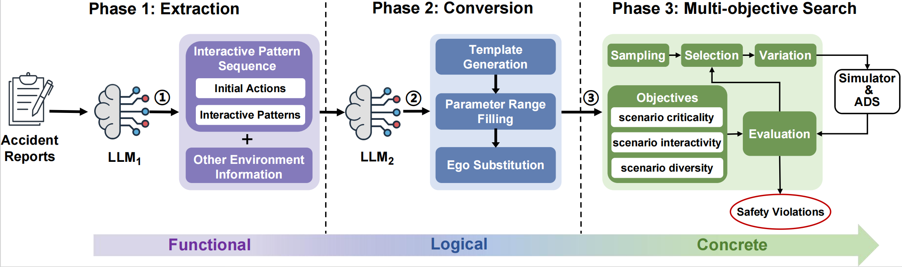

# LeGEND
This is the repository for our paper "LeGEND: A Top-Down Approach to Scenario Generation of Autonomous Driving Systems Assisted by Large Language Models".

## Approach Overview


The workflow of our approach is depicted in the above figure, which consists of three phases. The first two phases are in charge of the transformation from natural language that documents functional scenarios to logical scenarios in formal DSL:
* In Phase 1, LLM<sub>1</sub> extracts the useful information in an accident report and records them into an interactive pattern sequence (IPS);
* In Phase 2, taking an IPS as input, LLM<sub>2</sub> translates it into a logical scenario represented in Domain Specific Language (DSL). <br />

In Phase 3, LeGEND employs a search-based technique to search for critical concrete scenarios, which is similar to existing search-based ADS testing techniques.


## Dependencies
* Ubuntu 22.04 LTS
* Apollo 7.0
* LGSVL 2021.3
* ChatGPT

## Usage
To reproduce the experimental results, users should follow the steps below:
### Preparation
* Install Baidu Apollo following [Apollo Installation](https://github.com/ApolloAuto/apollo?tab=readme-ov-file#installation)
* Install LGSVL simulator following [LGSVL Installation](https://github.com/YuqiHuai/SORA-SVL)
* Clone this project and create a virtual environment: <br />
  ```conda create -n legend python=3.8```
* Install the required packages: <br />
  ```pip install -r requirements.txt```
* Comment out certain lines to address the known issue with ```astunparse``` in Python, following the instructions at [here](https://github.com/simonpercivall/astunparse/issues/43#issue-554412833)
* Set your ChatGPT API key and other configurations in ```configs/config.yaml```

### Run the Transformation
The core technique of LeGEND involves transforming accident reports into logical scenarios in DSL format, utilizing two large language models. In our paper, we selected 20 accident reports from the NHTSA database as initial seeds, covering a variety of road types and vehicle counts. <br /> 
To evaluate this transformation process, you can execute the script found in the ```/scripts``` directory: <br />
* ```cd scripts && python run_transformation.py```

### Run the Complete Framework
* Launch the LGSVL simulator by executing the file named ```simulator``` in the unzipped LGSVL directory. Then, open the cloud web
interface at ```http://localhost``` and start an API-only simulation. If successfully, you should see ```API Ready!``` on the simulator GUI.
* Start Apollo inside the apollo container: <br />
  ``` bash scripts/bootstrap.sh ``` <br />
  ``` bash scripts/bridge ```
* In the Apollo container, start Apollo Dreamview, which can be accessed at ```http://localhost:8888```: <br />
  ```bash scripts/bootstrap_lgsvl.sh start```
* While still in the container, initiate the bridge between Apollo and LGSVL: <br />
  ```bash scripts/bridge.sh```
* Open another terminal and run the complete testing framework: <br />
  ``` conda activate legend && python main.py```

## Project Structure
```
.
├── configs                           
│   ├── config.yaml                   # Necessary settings and hyperparameters for the approach
│   ├── curve_road                    # Road data and default settings for parameters
│   └── straight_road                 # Road data and default settings for parameters
├── data
│   └── accident_reports              # Selected accident reports from NHTSA
├── legend
│   ├── core                          # The source code of our approach
│   │   ├── algorithm.py              
│   │   ├── chromosome.py
│   │   ├── converter.py
│   │   ├── extractor.py              
│   │   ├── scenario_model.py
│   │   ├── simulation.py
│   │   ├── statement.py
│   │   └── testcase.py
│   └── utils                         # Tools for API calls and simulations
│       ├── fnds.py
│       ├── llm_util.py
│       ├── replay.py
│       └── sim_util.py
├── lgsvl                             # Code for simulator
├── main.py                           # Entrance for this project
├── README.md
└── requirements.txt


